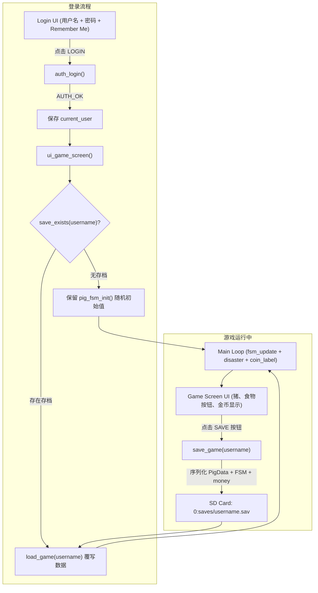
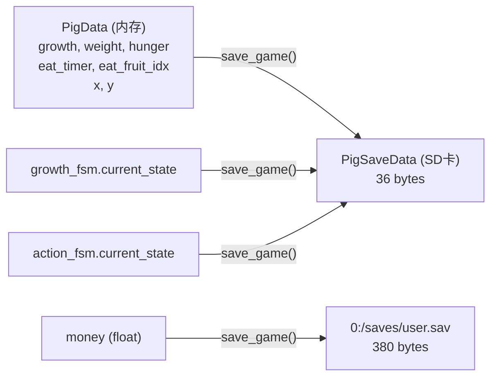

# 游戏存档系统架构设计 (完善版)

> **版本**: v2.1
> **日期**: 2026-06-01
> **平台**: GD32H7xx + LVGL + FATFS + SD卡

---

## 1. 概述

本架构实现完整的游戏存档系统，支持以下功能：

| 功能 | 触发方式 | 说明 |
|------|---------|------|
| **存档 (Save)** | 游戏界面点击 SAVE 按钮 | 保存每只猪的状态、金币、FSM 状态机到 SD 卡，与当前用户绑定 |
| **读档 (Load)** | 点击 LOGIN 按钮，验证成功后自动检测并加载 | 从 SD 卡读取对应用户的存档，恢复全部游戏状态 |
| **新游戏 (New Game)** | 登录成功但无存档时自动进入 | 使用 `pig_fsm_init()` 随机初始化 |

---

## 2. 数据流架构



---

## 3. 存档文件格式 (二进制)

### 文件路径

```
0:/saves/<username>.sav
```

例如: `0:/saves/admin.sav`、`0:/saves/player1.sav`

### 二进制布局 (每用户文件 380 字节)

| 偏移 | 大小 | 字段 | 类型 | 说明 |
|------|------|------|------|------|
| 0 | 4 | magic | uint32 | 魔数 `0x50494753` ("PIGS") |
| 4 | 4 | version | uint32 | 格式版本号 (当前: 1) |
| 8 | 4 | money | float | 金币数额 |
| 12 | 4 | checksum | uint32 | 简单校验和 (所有数据字节累加) |
| 16 | 4 | pig_count | int32 | 猪数量 = MAX_PIGS (10) |
| 20 | 36x10 | pigs[10] | PigSaveData[] | 每只猪 36 字节 |

**总文件大小**: 20 + 360 = **380 字节**

### PigSaveData 结构 (每只猪 36 字节)

| 偏移 | 大小 | 字段 | 类型 | 说明 |
|------|------|------|------|------|
| 0 | 4 | growth | float | 生长值 |
| 4 | 4 | weight | float | 体重 |
| 8 | 4 | hunger | float | 饥饿值 |
| 12 | 4 | eat_timer | float | 进食剩余时间 |
| 16 | 4 | eat_fruit_idx | int32 | 正在吃的食物索引 (-1 表示无) |
| 20 | 4 | x | int32 | 屏幕 X 坐标 |
| 24 | 4 | y | int32 | 屏幕 Y 坐标 |
| 28 | 4 | growth_state | int32 | NORMAL=0 / BIG=1 / SLAUGHTER=2 |
| 32 | 4 | action_state | int32 | ACTION_IDLE=0 / ACTION_EAT=1 |

---

## 4. 需持久化的游戏状态映射

### 4.1 PigData -> PigSaveData (写档)



### 4.2 PigSaveData -> PigData (读档)

| PigSaveData 字段 | 恢复到 | 额外处理 |
|---|---|---|
| `growth` | `pig_fsms[i].pig_t.growth` | -- |
| `weight` | `pig_fsms[i].pig_t.weight` | -- |
| `hunger` | `pig_fsms[i].pig_t.hunger` | -- |
| `eat_timer` | `pig_fsms[i].pig_t.eat_timer` | 若 > 0 则需恢复 EAT 状态 |
| `eat_fruit_idx` | `pig_fsms[i].pig_t.eat_fruit_idx` | -- |
| `x, y` | `pig_fsms[i].pig_t.x, y` + `lv_obj_set_pos()` | 更新 LVGL 对象位置 |
| `growth_state` | `pig_fsms[i].growth_fsm.current_state` | **触发图像切换** (见下方) |
| `action_state` | `pig_fsms[i].action_fsm.current_state` | 恢复 FSM 状态 |

### 4.3 猪图像的恢复逻辑

猪图像 (`image_pig_small` / `image_pig_big`) **不保存在存档中**，因为图像数据通过 `read_file_to_array()` 从 SD 卡 BIN 文件加载。存档只保存 `growth_state`，读档时据此恢复显示的图像：

```
growth_state == NORMAL    -> lv_img_set_src(pig.img_pig, &pig.image_pig_small)
growth_state == BIG       -> lv_img_set_src(pig.img_pig, &pig.image_pig_big)
growth_state == SLAUGHTER -> lv_img_set_src(pig.img_pig, &pig.image_pig_small)
```

### 4.4 不需要持久化的字段

| 字段 | 原因 |
|------|------|
| `PigData.image_pig_small` (`lv_img_dsc_t`) | 运行时从 SD 卡 BIN 文件加载，加载后 data 指针指向 SDRAM |
| `PigData.image_pig_big` (`lv_img_dsc_t`) | 同上 |
| `PigData.img_pig` (`lv_obj_t*`) | LVGL 运行时对象，由 `ui_game_screen()` 创建 |
| `PigData.id` | 由数组索引已知 (i) |
| `Fsm.table` / `enterFun[]` / `exitFun[]` / `updateFun[]` | 在 `pig_fsm_init()` 中初始化，属于代码逻辑不变量 |
| `Foods[]` / `coin_label` | 全局常量/UI 对象，不随存档变化 |

---

## 5. API 设计

### 5.1 `save.h` -- 存档/读档接口

```c
#ifndef SAVE_H
#define SAVE_H

#include <stdbool.h>

#define SAVE_MAGIC      0x50494753  // "PIGS"
#define SAVE_VERSION    1
#define SAVE_DIR        "0:/saves"

/* 每只猪的持久化数据结构 (36 bytes) */
typedef struct {
    float growth;
    float weight;
    float hunger;
    float eat_timer;
    int   eat_fruit_idx;
    int   x;
    int   y;
    int   growth_state;      // 0=NORMAL, 1=BIG, 2=SLAUGHTER
    int   action_state;      // 0=ACTION_IDLE, 1=ACTION_EAT
} PigSaveData;

/* 保存游戏进度到 0:/saves/<username>.sav */
bool save_game(const char *username);

/* 从 0:/saves/<username>.sav 加载游戏进度 */
bool load_game(const char *username);

/* 检查用户是否有存档文件 */
bool save_exists(const char *username);

/* 构建存档文件路径 (内部工具函数) */
void save_build_path(const char *username, char *path, int max_len);

#endif
```

### 5.2 新增/修改的 UI API

| 函数 | 文件 | 说明 |
|------|------|------|
| `save_btn_cb(lv_event_t *e)` | `gameui/ui_game_screen.c` | SAVE 按钮回调，调用 `save_game(current_user)` |
| `login_btn_cb(lv_event_t *e)` | `gameui/ui_login.c` | **修改**: 登录成功后设置 `current_user`，进入 `ui_game_screen()` 自动检测存档 |

---

## 6. 核心逻辑实现

### 6.1 `save_game()` -- 写档

```c
bool save_game(const char *username) {
    char path[64];
    save_build_path(username, path, sizeof(path));

    // 创建 saves 目录 (如不存在)
    f_mkdir(SAVE_DIR);

    FIL file;
    FRESULT res = f_open(&file, path, FA_WRITE | FA_CREATE_ALWAYS);
    if (res != FR_OK) return false;

    UINT bw;

    // 写入头部
    uint32_t magic = SAVE_MAGIC;
    uint32_t version = SAVE_VERSION;
    uint32_t count = MAX_PIGS;
    uint32_t checksum = 0;

    f_write(&file, &magic, 4, &bw);
    f_write(&file, &version, 4, &bw);
    f_write(&file, &money, 4, &bw);
    checksum += *(uint32_t*)&money;
    f_write(&file, &checksum, 4, &bw);  // 占位，最后回填
    f_write(&file, &count, 4, &bw);

    // 写入每只猪的数据
    for (int i = 0; i < MAX_PIGS; i++) {
        PigSaveData psd;
        psd.growth        = pig_fsms[i].pig_t.growth;
        psd.weight        = pig_fsms[i].pig_t.weight;
        psd.hunger        = pig_fsms[i].pig_t.hunger;
        psd.eat_timer     = pig_fsms[i].pig_t.eat_timer;
        psd.eat_fruit_idx = pig_fsms[i].pig_t.eat_fruit_idx;
        psd.x             = pig_fsms[i].pig_t.x;
        psd.y             = pig_fsms[i].pig_t.y;
        psd.growth_state  = pig_fsms[i].growth_fsm.current_state;
        psd.action_state  = pig_fsms[i].action_fsm.current_state;

        f_write(&file, &psd, sizeof(PigSaveData), &bw);

        // 累加校验和
        uint8_t *p = (uint8_t*)&psd;
        for (int j = 0; j < sizeof(PigSaveData); j++) {
            checksum += p[j];
        }
    }

    // 回填校验和 (位于偏移 12)
    f_lseek(&file, 12);
    f_write(&file, &checksum, 4, &bw);

    f_close(&file);
    return true;
}
```

### 6.2 `load_game()` -- 读档

```c
bool load_game(const char *username) {
    char path[64];
    save_build_path(username, path, sizeof(path));

    FIL file;
    FRESULT res = f_open(&file, path, FA_READ);
    if (res != FR_OK) return false;

    UINT br;
    uint32_t magic, version, checksum, saved_checksum, count;

    f_read(&file, &magic, 4, &br);
    if (magic != SAVE_MAGIC) { f_close(&file); return false; }

    f_read(&file, &version, 4, &br);
    if (version != SAVE_VERSION) { f_close(&file); return false; }

    f_read(&file, &money, 4, &br);

    f_read(&file, &saved_checksum, 4, &br);

    f_read(&file, &count, 4, &br);
    if (count != MAX_PIGS) { f_close(&file); return false; }

    uint32_t calc_checksum = *(uint32_t*)&money;

    for (int i = 0; i < MAX_PIGS; i++) {
        PigSaveData psd;
        f_read(&file, &psd, sizeof(PigSaveData), &br);

        // 覆写猪数据
        pig_fsms[i].pig_t.growth        = psd.growth;
        pig_fsms[i].pig_t.weight        = psd.weight;
        pig_fsms[i].pig_t.hunger        = psd.hunger;
        pig_fsms[i].pig_t.eat_timer     = psd.eat_timer;
        pig_fsms[i].pig_t.eat_fruit_idx = psd.eat_fruit_idx;
        pig_fsms[i].pig_t.x             = psd.x;
        pig_fsms[i].pig_t.y             = psd.y;

        // 恢复 FSM 状态
        pig_fsms[i].growth_fsm.current_state = psd.growth_state;
        pig_fsms[i].action_fsm.current_state = psd.action_state;

        // 恢复猪图像
        if (pig_fsms[i].pig_t.img_pig != NULL) {
            if (psd.growth_state == BIG) {
                lv_img_set_src(pig_fsms[i].pig_t.img_pig,
                              &pig_fsms[i].pig_t.image_pig_big);
            } else {
                lv_img_set_src(pig_fsms[i].pig_t.img_pig,
                              &pig_fsms[i].pig_t.image_pig_small);
            }
            lv_obj_set_pos(pig_fsms[i].pig_t.img_pig, psd.x, psd.y);
        }

        // 累加校验和
        uint8_t *p = (uint8_t*)&psd;
        for (int j = 0; j < sizeof(PigSaveData); j++) {
            calc_checksum += p[j];
        }
    }

    f_close(&file);

    // 校验
    if (calc_checksum != saved_checksum) {
        // 校验失败，恢复默认值
        money = 200.0f;
        return false;
    }

    // 更新金币显示
    if (coin_label != NULL) {
        lv_label_set_text_fmt(coin_label, "%.0f", money);
    }

    return true;
}
```

### 6.3 `save_exists()` -- 存档检测

```c
bool save_exists(const char *username) {
    char path[64];
    save_build_path(username, path, sizeof(path));
    FIL file;
    FRESULT res = f_open(&file, path, FA_READ);
    if (res == FR_OK) {
        f_close(&file);
        return true;
    }
    return false;
}
```

### 6.4 `save_build_path()` -- 路径构建

```c
void save_build_path(const char *username, char *path, int max_len) {
    snprintf(path, max_len, "0:/saves/%s.sav", username);
}
```

---

## 7. UI 集成方案

### 7.1 游戏界面 -- SAVE 按钮

在 [`gameui/ui_game_screen.c`](gameui/ui_game_screen.c) 的 `ui_game_screen()` 中添加 SAVE 按钮：

```c
// 在 ui_game_screen() 末尾添加 (在 lv_scr_load_anim 之前)
lv_obj_t *save_btn = lv_btn_create(game_screen);
lv_obj_set_size(save_btn, 100, 40);
lv_obj_align(save_btn, LV_ALIGN_TOP_RIGHT, -20, 10);
lv_obj_add_event_cb(save_btn, save_btn_cb, LV_EVENT_CLICKED, NULL);

lv_obj_t *save_label = lv_label_create(save_btn);
lv_label_set_text(save_label, "SAVE");
lv_obj_center(save_label);
```

**SAVE 按钮回调**（新增函数）：

```c
static void save_btn_cb(lv_event_t *e) {
    extern char current_user[];
    if (current_user[0] != '\0') {
        if (save_game(current_user)) {
            // 显示 "Saved!" 提示
            lv_obj_t *msg = lv_label_create(lv_scr_act());
            lv_label_set_text(msg, "Saved!");
            lv_obj_set_style_text_color(msg, lv_color_hex(0x00FF00), 0);
            lv_obj_align(msg, LV_ALIGN_TOP_MID, 0, 50);
            // 2 秒后自动消失 (可用 lv_timer 实现)
        }
    }
}
```

### 7.2 登录界面 -- LOGIN 按钮 (统一登录+加载)

**不需要新增 LOAD 按钮**，`login_btn_cb` 同时负责验证、记录用户、进入游戏（自动检测并加载存档）：

```c
static void login_btn_cb(lv_event_t *e) {
    const char *username = lv_textarea_get_text(username_ta);
    const char *password = lv_textarea_get_text(password_ta);

    AuthResult res = auth_login(username, password);

    switch (res) {
        case AUTH_OK: {
            // 记录当前用户
            extern char current_user[];
            strncpy(current_user, username, MAX_USERNAME_LEN);
            current_user[MAX_USERNAME_LEN] = '\0';

            // Remember me
            if (remember_me) {
                auth_save_remember(username, password);
            }

            // 进入游戏 (ui_game_screen 内部会自动 load 存档)
            ui_game_screen(NULL);
            break;
        }
        case AUTH_ERR_USER_NOT_FOUND:
            // 显示用户不存在
            break;
        case AUTH_ERR_WRONG_PASSWORD:
            // 显示密码错误
            break;
        default:
            break;
    }
}
```

### 7.3 游戏界面初始化时自动 Load

修改 [`gameui/ui_game_screen.c`](gameui/ui_game_screen.c) 的 `ui_game_screen()`：

```c
void ui_game_screen(lv_event_t *e) {
    extern char current_user[];
    bool has_save = (current_user[0] != '\0') && save_exists(current_user);

    // ... 创建背景图、猪、食物按钮、金币标签 (现有代码不变) ...

    // 猪初始化
    for (int i = 0; i < MAX_PIGS; i++) {
        pig_fsm_init(&pig_fsms[i], i);
        pig_fsms[i].pig_t.x = 170 + i % 5 * 120 + 50;
        pig_fsms[i].pig_t.y = (i > 4) ? 350 : 200;
        pig_fsms[i].pig_t.img_pig = lv_img_create(game_screen);
        lv_img_set_src(pig_fsms[i].pig_t.img_pig, &pig_fsms[i].pig_t.image_pig_small);
        lv_obj_set_pos(pig_fsms[i].pig_t.img_pig, pig_fsms[i].pig_t.x, pig_fsms[i].pig_t.y);
        // ... (点击事件、动画等保持不变) ...
    }

    // 【关键】所有 UI 创建完成后，如果用户有存档则加载覆写
    if (has_save) {
        load_game(current_user);  // 覆写 pig_fsm_init() 的随机初始值为存档值
    }

    lv_scr_load_anim(game_screen, LV_SCR_LOAD_ANIM_FADE_ON, 300, 0, true);
}
```

### 7.4 完整交互流程

```
新用户注册 + 新游戏:
  用户 -> 输入用户名/密码 -> 点击 REGISTER
    -> auth_register() 写入 user.cfg
    -> 点击 LOGIN -> auth_login() 验证成功 -> current_user = username
    -> ui_game_screen() -> pig_fsm_init() 随机初始化
    -> save_exists() = false -> 不加载存档
    -> 新游戏开始

老用户登录 + 读档:
  用户 -> 输入用户名/密码 -> 点击 LOGIN
    -> auth_login() 验证成功 -> current_user = username
    -> ui_game_screen() -> pig_fsm_init() (加载图像+随机数据)
    -> save_exists() = true -> load_game() (覆写为存档数据)
    -> 恢复所有猪状态 + 金币 + 图像 -> 继续游戏

游戏中存档:
  游戏运行中 -> 用户点击 SAVE 按钮
    -> save_btn_cb() -> save_game(current_user)
    -> 序列化全部 pig_fsms[] + money -> 写入 0:/saves/<user>.sav
    -> 显示 "Saved!" 提示 -> 继续游戏 (无中断)
```

---

## 8. Main 循环集成

[`main.c`](main.c) 中 `current_user` 全局变量已存在 (第 15 行)：

```c
char current_user[MAX_USERNAME_LEN + 1] = {0};
```

主循环中金币实时更新已存在 (第 102-104 行)。`save_game()` 不修改内存中的 `money`，`load_game()` 会直接写 `money` 并刷新 `coin_label`。

---

## 9. 异常处理

| 异常场景 | 处理策略 |
|----------|---------|
| SD 卡未初始化 | `f_open()` 返回错误 -> `save_game()` / `load_game()` 返回 false |
| 存档文件不存在 | `save_exists()` 返回 false -> 走新游戏流程 |
| 存档文件损坏 (magic/version 不匹配) | `load_game()` 返回 false -> 保留随机初始值，提示用户 |
| 存档文件校验和不匹配 | `load_game()` 返回 false -> 恢复 money=200，所有猪保留默认 |
| 多用户不互相覆盖 | 每个用户独立文件 `0:/saves/<username>.sav` -> 天然隔离 |
| 磁盘空间不足 | `f_write()` 返回错误 -> `save_game()` 返回 false -> 提示 "Save failed!" |

---

## 10. 实现清单

| # | 任务 | 文件 |
|---|------|------|
| 1 | 定义 `PigSaveData` 结构体和 API 声明 | `gamelogic/save.h` |
| 2 | 实现 `save_build_path()` | `gamelogic/save.c` |
| 3 | 实现 `save_exists()` | `gamelogic/save.c` |
| 4 | 实现 `save_game()` -- 序列化 + FATFS 写入 | `gamelogic/save.c` |
| 5 | 实现 `load_game()` -- FATFS 读取 + 反序列化 + 覆写 pig_fsms[] | `gamelogic/save.c` |
| 6 | 添加 SAVE 按钮及回调到游戏界面 | `gameui/ui_game_screen.c` |
| 7 | 修改 `ui_game_screen()` -- 初始化后自动检测存档并 load | `gameui/ui_game_screen.c` |
| 8 | 修改 `login_btn_cb()` -- 登录成功后设置 current_user，进入游戏 | `gameui/ui_login.c` |
| 9 | 确认 `main.c` 中 `current_user` 声明已存在 | `main.c` |
| 10 | 测试: 注册 -> 游戏 -> SAVE -> 退出 -> LOGIN -> 自动读档完整流程 | 全套 |
