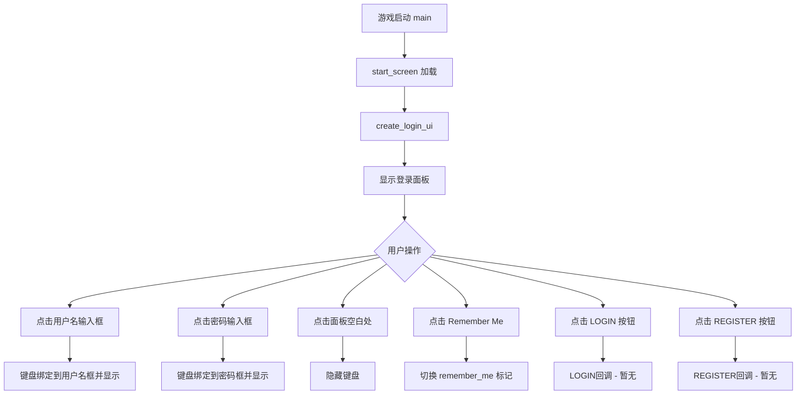
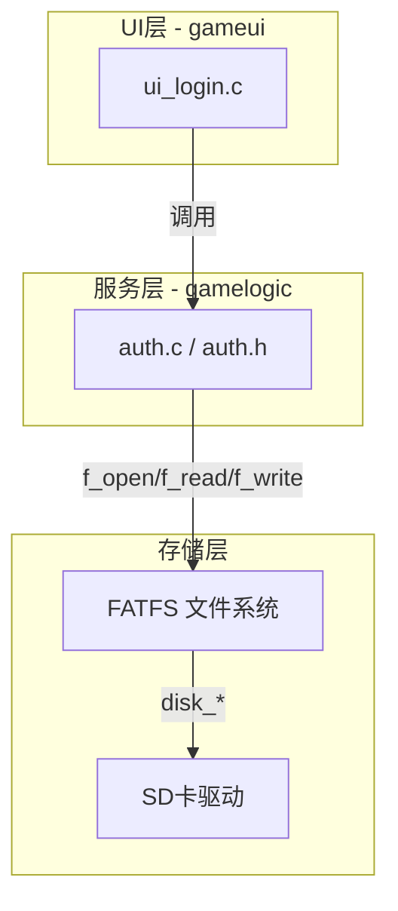
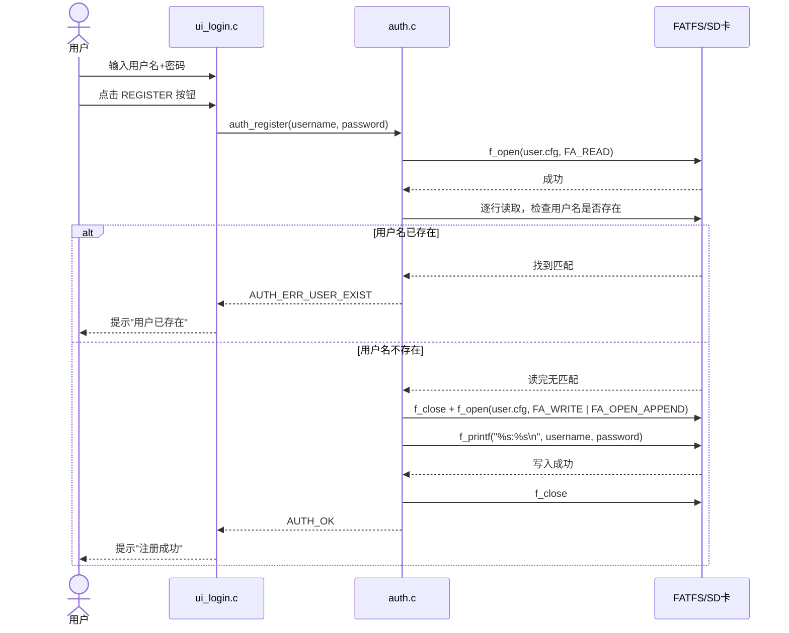
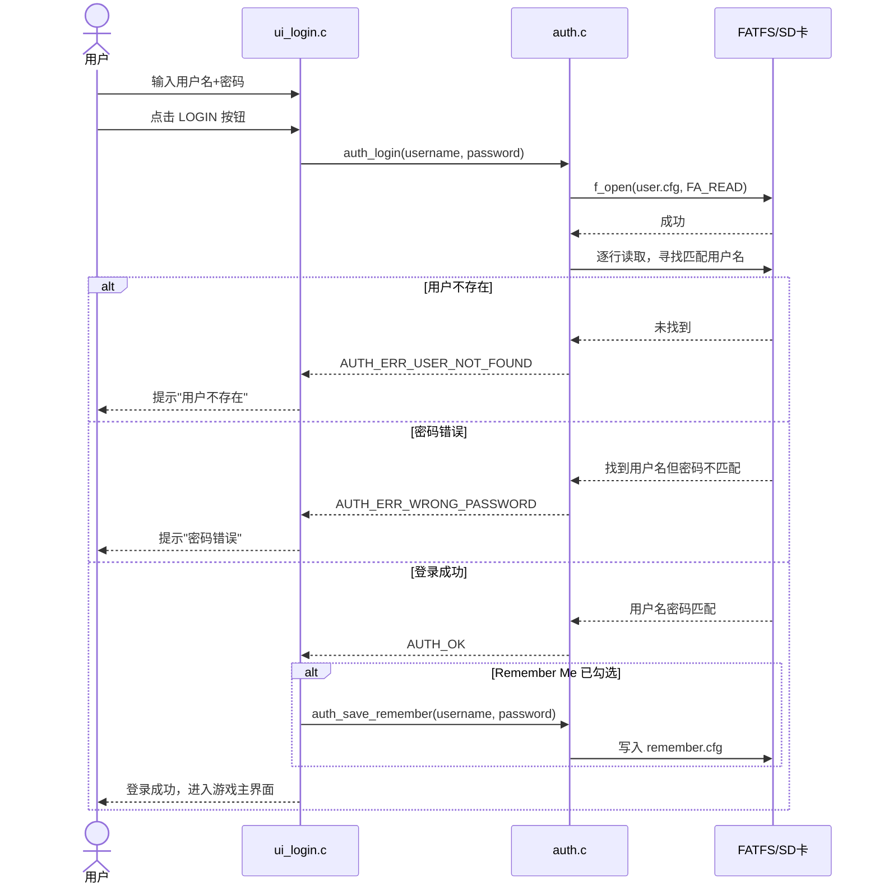
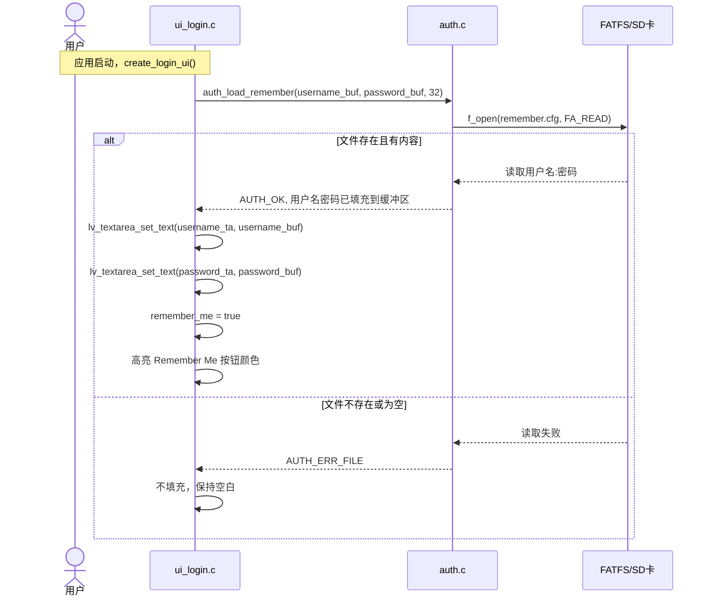
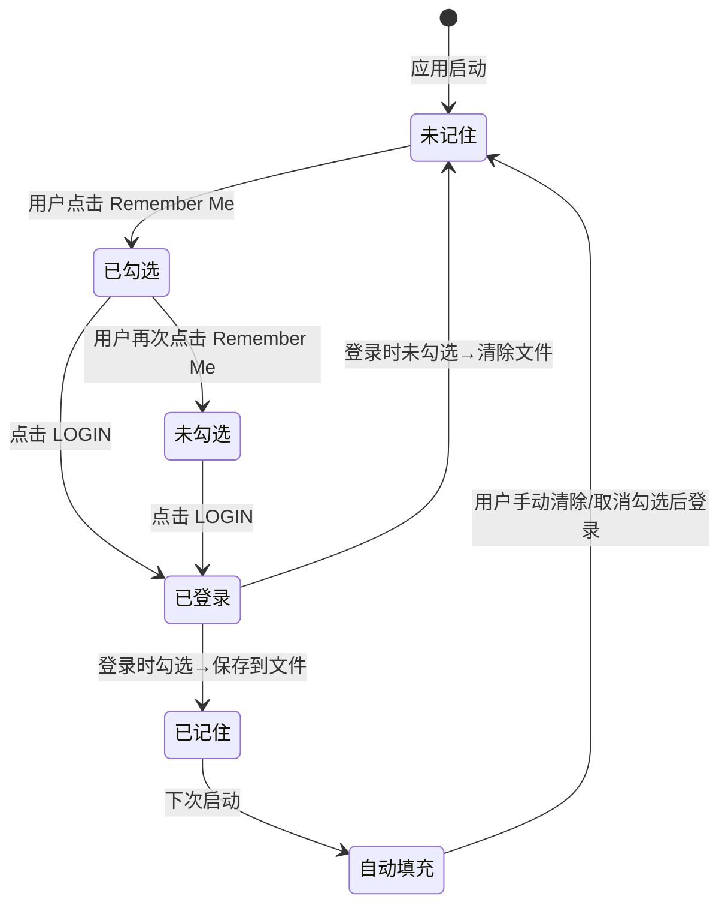

# 登录认证与密码存储架构设计

## 1. 概述

本文档基于现有项目 [`gameui/ui_login.c`](../gameui/ui_login.c) 的登录界面，设计一套完整的**用户密码存储方案**和**"记住我"密码记忆方案**。项目运行于 **GD32H7xx** 嵌入式平台，使用 **LVGL** 图形框架，**FATFS** 文件系统管理 **SD卡** 存储。

---

## 2. 现有环境分析

### 2.1 硬件资源

| 资源 | 现状 |
|------|------|
| MCU | GD32H7xx (Cortex-M7) |
| 显示 | 1024x600 LCD，通过 LTDC + TLI 驱动 |
| 存储 | SD卡 (SDIO接口)，已有完整驱动 [`Drivers/sdcard.c`](../Drivers/sdcard.c) |
| 文件系统 | FATFS (R0.15)，已集成于 [`FATFS/`](../FATFS/) |
| 动态内存 | SDRAM 32MB堆，通过 [`Drivers/sdram_malloc.h`](../Drivers/sdram_malloc.h) 的 `pvPortMalloc`/`vPortFree` 管理 |

### 2.2 现有文件I/O能力

项目中已有 [`read_file_to_array()`](../read_file_to_array.c) 函数用于从SD卡读取二进制文件（如图片）。路径格式为 `"0:/filename.bin"`，其中 `"0:"` 表示 FATFS 的驱动器号。

FATFS 已启用读写功能 [`FF_FS_READONLY = 0`](../FATFS/ffconf.h:11)，支持：
- `f_open`, `f_close`, `f_read`, `f_write` ― 文件读写
- `f_printf`, `f_gets` ― 格式化字符串操作 [`FF_USE_STRFUNC = 1`](../FATFS/ffconf.h:59)
- 长文件名支持 [`FF_USE_LFN = 3`](../FATFS/ffconf.h:116)（堆分配）

### 2.3 现有登录UI交互流程



当前状态：**LOGIN 和 REGISTER 按钮没有注册事件回调**，无法执行登录/注册操作。

---

## 3. 整体架构设计

### 3.1 新增模块

创建两个新文件，作为认证功能的核心模块：

```
gamelogic/
├── auth.c          # 新增：认证管理实现
├── auth.h          # 新增：认证管理头文件
└── ...
```

### 3.2 架构分层



### 3.3 模块职责

| 模块 | 文件 | 职责 |
|------|------|------|
| UI层 | [`ui_login.c`](../gameui/ui_login.c) | 界面交互、输入事件处理、回调触发 |
| 服务层 | [`auth.c`](../gamelogic/auth.c) + [`auth.h`](../gamelogic/auth.h) | 用户管理、密码验证、文件读写封装 |
| 存储层 | FATFS + SD卡驱动 | 实际文件读写 |

---

## 4. 数据存储方案

### 4.1 文件结构

在SD卡上使用 **两个文件** 分别管理用户数据和记住我状态：

```
SD卡根目录:
├── user.cfg          # 用户账户数据文件
├── remember.cfg      # 记住我状态文件
└── ... (其他游戏资源)
```

### 4.2 用户账户文件 `user.cfg` 格式

采用 **纯文本 + 定界符** 格式，便于读写和调试：

```
# user.cfg
# 格式: username:password
user1:pass123
john_doe:abc456
admin:admin888
```

- 每行一个用户，格式为 `用户名:密码`
- 用户名和密码均限制 ≤ 31 字符（与 UI 输入框 [`lv_textarea_set_max_length(ta, 31)`](../gameui/ui_login.c:74) 一致）
- 使用冒号 `:` 作为分隔符（用户名中禁止使用冒号）

### 4.3 记住我文件 `remember.cfg` 格式

```
# remember.cfg
# 格式: username:password
john_doe:abc456
```

- 仅一行，存储最后一次 "Remember Me" 勾选时的用户名和密码
- 如果用户取消勾选或注销，则清空此文件

### 4.4 数据结构定义

在 [`auth.h`](../gamelogic/auth.h) 中定义：

```c
#ifndef AUTH_H
#define AUTH_H

#include <stdbool.h>

#define MAX_USERNAME_LEN    31
#define MAX_PASSWORD_LEN    31
#define MAX_USERS           10
#define USER_CFG_PATH       "0:/user.cfg"
#define REMEMBER_CFG_PATH   "0:/remember.cfg"

/* 单个用户数据结构 */
typedef struct {
    char username[MAX_USERNAME_LEN + 1];
    char password[MAX_PASSWORD_LEN + 1];
} UserAccount;

/* 认证结果枚举 */
typedef enum {
    AUTH_OK = 0,
    AUTH_ERR_FILE,
    AUTH_ERR_FORMAT,
    AUTH_ERR_USER_EXIST,
    AUTH_ERR_USER_NOT_FOUND,
    AUTH_ERR_WRONG_PASSWORD,
} AuthResult;

/* 用户管理函数 */
AuthResult auth_register(const char *username, const char *password);
AuthResult auth_login(const char *username, const char *password);
bool      auth_user_exists(const char *username);

/* 记住我功能函数 */
AuthResult auth_save_remember(const char *username, const char *password);
AuthResult auth_load_remember(char *username, char *password, int max_len);
void      auth_clear_remember(void);

#endif
```

---

## 5. 核心流程设计

### 5.1 注册流程



### 5.2 登录流程



### 5.3 "记住我" 自动填充流程



---

## 6. "Remember Me" 状态管理

### 6.1 状态模型



### 6.2 UI交互映射

在 [`ui_login.c`](../gameui/ui_login.c) 中：

| 交互 | 当前状态 | 修改方案 |
|------|---------|---------|
| [`remember_btn_cb`](../gameui/ui_login.c:37) 点击切换 | 仅切换 `remember_me` 布尔值 + 改变按钮颜色 | 保持不变 |
| [`login_btn`](../gameui/ui_login.c:103) 回调 | 无回调 | **新增** login_btn_cb，登录成功后根据 `remember_me` 状态调用 `auth_save_remember()` 或 `auth_clear_remember()` |
| [`create_login_ui()`](../gameui/ui_login.c:46) 创建时 | 无自动填充 | **新增** 调用 `auth_load_remember()`，若成功则自动填充文本框并置 `remember_me = true` |
| [`reg_btn`](../gameui/ui_login.c:110) 回调 | 无回调 | **新增** reg_btn_cb，调用 `auth_register()` |

---

## 7. 文件操作策略

### 7.1 FATFS 操作封装

```c
/* auth.c 内部实现 */

/* 从 user.cfg 读取所有用户，存入数组 */
static int read_all_users(UserAccount *users, int max_count);

/* 向 user.cfg 追加一个新用户 */
static AuthResult append_user(const char *username, const char *password);

/* 在 user.cfg 中查找用户并验证密码 */
static AuthResult find_and_verify(const char *username, const char *password);
```

### 7.2 关键实现细节

**注册 (`auth_register`)**：
1. `f_open(&fil, USER_CFG_PATH, FA_READ)` ― 检查文件是否存在
2. 如果文件不存在，直接创建并写入；如果存在，逐行读取检查用户名是否重复
3. `f_open(&fil, USER_CFG_PATH, FA_WRITE | FA_OPEN_APPEND)` ― 追加写入
4. `f_printf(&fil, "%s:%s\n", username, password)` ― 写入新用户

**登录 (`auth_login`)**：
1. `f_open(&fil, USER_CFG_PATH, FA_READ)` ― 打开文件
2. `f_gets(line, sizeof(line), &fil)` ― 逐行读取
3. `sscanf(line, "%31[^:]:%31s", user, pass)` ― 解析用户名和密码
4. 比较输入值与文件中的值

**记住我保存 (`auth_save_remember`)**：
1. `f_open(&fil, REMEMBER_CFG_PATH, FA_CREATE_ALWAYS | FA_WRITE)` ― 创建/覆盖
2. `f_printf(&fil, "%s:%s\n", username, password)` ― 写入

**记住我加载 (`auth_load_remember`)**：
1. `f_open(&fil, REMEMBER_CFG_PATH, FA_READ)` ― 打开
2. `f_gets(line, sizeof(line), &fil)` ― 读取第一行
3. `sscanf(line, "%31[^:]:%31s", username, password)` ― 解析

---

## 8. 集成到现有代码

### 8.1 UI文件修改清单

需要在 [`gameui/ui_login.c`](../gameui/ui_login.c) 中修改以下部分：

| 位置 | 修改内容 |
|------|---------|
| 文件头部 #include | 增加 `#include "gamelogic/auth.h"` |
| [`create_login_ui()`](../gameui/ui_login.c:46) 末尾 | 增加 `auth_load_remember()` 自动填充逻辑 |
| LOGIN 按钮创建处 [`line 103-108`](../gameui/ui_login.c:103) | 增加回调 `login_btn_cb` |
| REGISTER 按钮创建处 [`line 110-115`](../gameui/ui_login.c:110) | 增加回调 `reg_btn_cb` |
| 新增 `#include <string.h>` | 用于字符串操作 |

### 8.2 新增回调函数

```c
/* LOGIN 按钮回调 */
static void login_btn_cb(lv_event_t *e)
{
    const char *username = lv_textarea_get_text(username_ta);
    const char *password = lv_textarea_get_text(password_ta);
    
    AuthResult result = auth_login(username, password);
    
    switch(result) {
        case AUTH_OK:
            // 处理 Remember Me
            if(remember_me) {
                auth_save_remember(username, password);
            } else {
                auth_clear_remember();
            }
            // 跳转到游戏主界面
            ui_game_screen(NULL);
            break;
        case AUTH_ERR_USER_NOT_FOUND:
            // 提示"用户不存在"
            break;
        case AUTH_ERR_WRONG_PASSWORD:
            // 提示"密码错误"
            break;
        default:
            break;
    }
}

/* REGISTER 按钮回调 */
static void reg_btn_cb(lv_event_t *e)
{
    const char *username = lv_textarea_get_text(username_ta);
    const char *password = lv_textarea_get_text(password_ta);
    
    AuthResult result = auth_register(username, password);
    
    switch(result) {
        case AUTH_OK:
            // 提示"注册成功"
            break;
        case AUTH_ERR_USER_EXIST:
            // 提示"用户已存在"
            break;
        default:
            break;
    }
}
```

### 8.3 自动填充逻辑（在 `create_login_ui()` 末尾）

```c
// 在创建完所有 UI 控件后，尝试加载记住的密码
char rem_user[32] = {0};
char rem_pass[32] = {0};

if(auth_load_remember(rem_user, rem_pass, sizeof(rem_user)) == AUTH_OK) {
    lv_textarea_set_text(username_ta, rem_user);
    lv_textarea_set_text(password_ta, rem_pass);
    remember_me = true;
    lv_obj_set_style_bg_color(remember_btn, lv_color_hex(0xFF0000), 0);
}
```

---

## 9. 安全考量

> ?? **声明**：本设计面向**嵌入式教育/演示项目**，注重功能性而非高安全性。不应用于生产级安全场景。

| 考量项 | 本方案 | 说明 |
|--------|-------|------|
| 密码存储 | **明文存储** | 密码以明文保存在 SD 卡 `user.cfg` 中。如需加强，可引入简单 XOR 或 CRC 混淆 |
| 文件访问 | 无加密 | SD 卡拔出后用 PC 可直接读取配置文件 |
| 输入校验 | 限制长度 31 字符 | UI 层已通过 [`lv_textarea_set_max_length`](../gameui/ui_login.c:74) 限制 |
| 分隔符转义 | 用户名禁止包含 `:` | 应在 `auth_register` 中校验 `strchr(username, ':') == NULL` |
| 文件操作安全 | 每次操作后 `f_close` | 防止文件描述符泄漏 |

### 可选增强（非必须）

如需基本的密码保护，可在 [`auth.c`](../gamelogic/auth.c) 中增加简单的 XOR 混淆：

```c
/* 简单的 XOR 混淆（非加密，仅防直接查看） */
#define XOR_KEY 0x5A

static void obfuscate(char *data, int len) {
    for(int i = 0; i < len && data[i] != '\0'; i++) {
        data[i] ^= XOR_KEY;
    }
}
```

---

## 10. 文件清单

### 10.1 新增文件

| 文件 | 说明 |
|------|------|
| [`gamelogic/auth.h`](../gamelogic/auth.h) | 认证模块头文件，定义数据结构、枚举和 API 声明 |
| [`gamelogic/auth.c`](../gamelogic/auth.c) | 认证模块实现，包含所有文件读写和业务逻辑 |

### 10.2 修改文件

| 文件 | 修改内容 |
|------|---------|
| [`gameui/ui_login.c`](../gameui/ui_login.c) | 增加 auth.h 头文件引用、新增 LOGIN/REGISTER 回调、增加"记住我"自动填充 |

---

## 11. 实现优先级

### Phase 1 ― 基础功能（核心）
1. 创建 [`auth.h`](../gamelogic/auth.h) ― 数据结构和 API 声明
2. 创建 [`auth.c`](../gamelogic/auth.c) ― 实现 `auth_register()` 和 `auth_login()`
3. 修改 [`ui_login.c`](../gameui/ui_login.c) ― 为 LOGIN 和 REGISTER 按钮添加回调

### Phase 2 ― 记住我功能
4. 在 [`auth.c`](../gamelogic/auth.c) 中实现 `auth_save_remember()`、`auth_load_remember()`、`auth_clear_remember()`
5. 在 [`ui_login.c`](../gameui/ui_login.c) 中集成自动填充逻辑
6. 在 LOGIN 回调中根据 `remember_me` 状态决定保存或清除

### Phase 3 ― 增强
7. 输入校验（用户名不含 `:`、空字符串检查）
8. 用户提示反馈（成功/失败消息弹窗）
